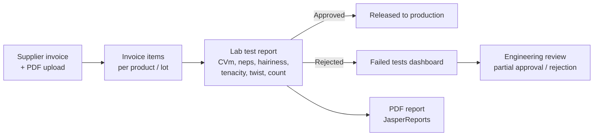
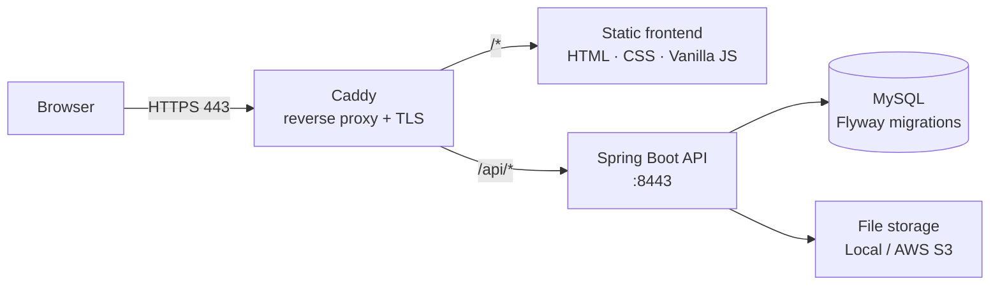

<p align="center">
  
</p>

<h1 align="center">FiberGuardian</h1>

<p align="center">
  <b>Quality control and traceability for incoming yarn in textile manufacturing</b><br>
  From the supplier's invoice to the lab report, every lot is tracked, tested, and audited.
</p>

<p align="center">
  
</p>

<p align="center">
  
  
  
  
  
  
  
  
</p>

---

## 🧵 The Problem

Textile mills buy yarn from many suppliers. When a lot arrives, it has to be matched to the
supplier's invoice (*nota fiscal*), sampled, and tested in the lab (evenness, hairiness, tenacity,
twist, count) before it can go to weaving. In many mills this process lives in spreadsheets and paper:

- Nobody can tell quickly **which lots were rejected, why, and who approved them**
- Lab reports are **edited or overwritten**, with no history
- Suppliers with recurring quality issues are **hard to identify**

## 💡 The Solution

FiberGuardian is a web system that runs the whole **incoming inspection** flow in one place,
with role-based access for each department and full auditing of who did what, and when.



### Key features

- **Receiving:** register supplier invoices with multiple items and attach the original PDF
- **Lab reports:** record yarn test results per lot, with an **approved / rejected** decision and the person accountable for it
- **PDF reports:** lab reports generated on the server with **JasperReports**
- **Failed tests dashboard:** filtered, paginated view of rejected lots for engineering follow-up
- **Supplier & product catalog:** CNPJ validation and one product code per supplier
- **User management:** five roles (`ADMIN`, `USUARIO`, `LABORATORIO`, `ENGENHARIA`, `ENG_LAB`) mapped to factory departments and shifts
- **Audit trail:** every record stores who created and last changed it, and when (Spring Data JPA auditing)

---

## 🔐 Security

Security was a design requirement from day one, following **OWASP** recommendations:

| Concern | How it is handled |
|---|---|
| Authentication | Server-side sessions (`JSESSIONID`), BCrypt password hashing, form login disabled in favor of a JSON login API |
| Session hardening | `HttpOnly` + `Secure` + `SameSite` cookies, **session fixation protection**, **one active session per user**, idle timeout |
| CSRF | Cookie-to-header token pattern (`XSRF-TOKEN` → `X-XSRF-TOKEN`) |
| Transport | **HTTPS enforced** on every request, with TLS on both backend and reverse proxy |
| Authorization | Rules per HTTP method and resource, following least privilege for each role |
| CORS | Explicit allow-list of origins, credentials enabled only for trusted frontends |
| Input validation | Bean Validation with **custom validators** (CNPJ, email, password strength, receipt date window) |
| Error handling | Centralized `@ControllerAdvice` returning structured **Problem Details** responses, with no stack traces leaked |

---

## 🏗️ Architecture



**Backend (Spring Boot 3.5 · Java 21)**
- Layered architecture: controllers → services → repositories, with **DTOs, assemblers, and disassemblers** keeping JPA entities out of the API contract
- **Jackson JSON Views** to expose different projections of the same resource
- **Dynamic JPQL queries** with constructor expressions and pagination for filtered listings
- **Flyway**-versioned schema with seed data, `ddl-auto=validate`, and `open-in-view` disabled
- Database-level integrity: foreign keys, unique constraints, and `CHECK` constraints on test values
- A **storage abstraction** (Strategy pattern) with local file system and AWS S3 implementations
- **OpenAPI / Swagger** documentation via springdoc

**Frontend (MPA · Vanilla JavaScript)**
- Modular JavaScript (IIFE modules under the `window.FiberGuardian` namespace), no framework
- Shared API client that handles CSRF tokens, sessions, and errors in one place
- Bootstrap 5 responsive UI with a single modal and confirmation system

**Infrastructure**
- **Caddy** as a single HTTPS entry point, routing `/api/*` to Spring Boot and everything else to the static frontend
- Deployed on an **Azure VM** for the Blusoft Evolution Labs 2025 presentation
- MySQL via Docker Compose for local development

### Data model highlights

The schema was designed by someone who knows the domain, not just CRUD:

- **Lab test results** use real spinning-mill quality metrics: CVm%, thin/thick places, neps, hairiness (H), tenacity, elongation, yarn count (Ne), and twist (TPM)
- **Document lifecycle:** lab and engineering reports move through `ATIVO → SUBSTITUIDO / INVALIDADO`, with links to the report they replace, so a reviewed report is **superseded, never overwritten**
- **Technical yarn specification** (`fio_tecnico`) with up to four fibers and percentages, count system (Ne, Nm, dtex, den), spinning system (ring, compact, OE, air-jet, vortex), and twist direction, all enforced with `CHECK` constraints

---

## 🏆 Recognition

**3rd place, Blusoft Evolution Labs 2025**, a startup pre-incubation program run by Blusoft.
FiberGuardian started as the final project of the **Entra21 Java Professional Qualification Program** and was then developed further for Evolution Labs.

**My role:** backend, frontend, and cloud deployment on Azure.

> This codebase also served as the foundation for
> [**DeslocaFácil**](https://github.com/rgiovann/moredevs2blu-hackaton2025-deslocafacil),
> which placed 4th at Hackathon +Devs2Blu 2025. Its security and architecture were reused to deliver
> a working MVP within the time limit of the hackathon.

---

## 🗺️ Roadmap

- [ ] Engineering review module: partial approval with usage restrictions, plus sample photos (schema is ready)
- [ ] Technical yarn specification screens linked to products (schema is ready)
- [ ] Supplier quality indicators (rejection rate per supplier and product)
- [ ] Broader automated test coverage (integration tests with Testcontainers)
- [ ] Containerized deployment of the full stack

---

## 🚀 Running Locally

### Prerequisites
- Java 21+ and Maven (or the included `mvnw`)
- Docker (for MySQL)
- [Caddy](https://caddyserver.com/download) and `http-server` (`npm install -g http-server`)
- Self-signed certificates for local HTTPS (see below)

### 1. Database
```bash
cd backend
docker compose up -d
```
Flyway creates the schema and loads test data on startup.

### 2. Backend
```bash
cd backend
./mvnw spring-boot:run
```
The API runs at `https://localhost:8443/api`.

### 3. Frontend + reverse proxy
1. Create self-signed `cert.pem` and `key.pem` in `frontend/cert` (the backend expects a matching `.p12` in `src/main/resources`)
2. Adjust `BASE_DIR`, `CERT_DIR`, and `WEBAPP_DIR` in `inicia_http_server_caddy.bat`
3. Run the `.bat`. It starts `http-server` with SSL and then Caddy
4. Open `https://localhost`

> ⚠️ The certificates are for local development only. Use valid certificates in production.

### Testing the API
Every `POST`, `PUT`, and `DELETE` request requires a valid session **and** a CSRF token.
Ready-to-use `curl` scripts live in `backend/src/test/scripts_bash`, and service-layer unit tests
use JUnit 5 and Mockito.

---

## 👤 Author

**Giovanni Leopoldo Rozza**, Backend Engineer · Java & Spring Boot · DevOps

[](https://www.linkedin.com/in/giovanni-leopoldo-rozza/)
[](https://github.com/rgiovann)
